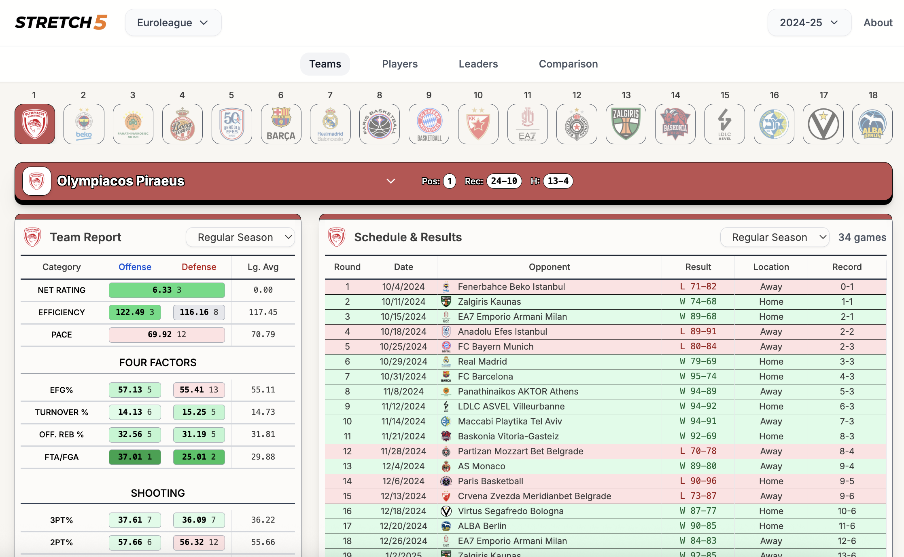
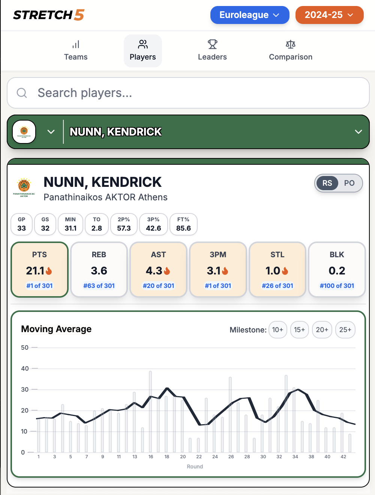
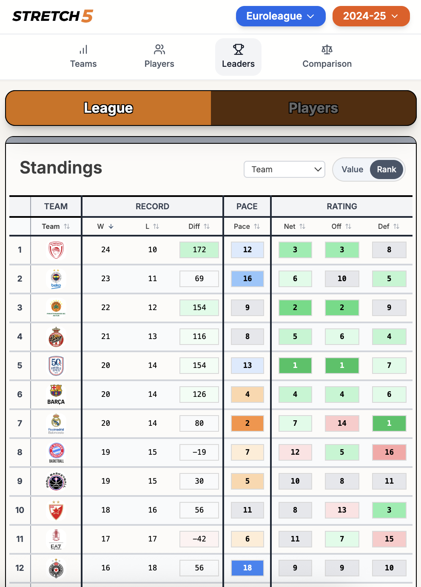
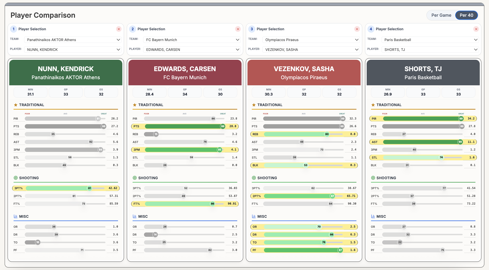

# stretch-5-analytics

# Stretch 5 Analytics

A modern basketball analytics platform created by Will Hanley — a former professional basketball player turned data scientist — with the goal of expanding to all leagues and levels across the world, making high quality data and analytics accessible for players, coaches, and fans.

## Features

### Teams, Players View

### Mobile Views

  
  

### Player Comparison
